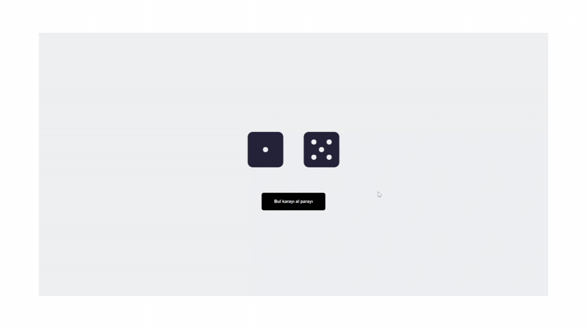

# Zar Atma Uygulaması

# Özellikler

- Zar Atma: Kullanıcı, bir düğmeye tıklayarak iki zarın rastgele yüzlerini görebilir. Zar yüzleri "bir"den "altı"ya kadar değişiklik göstermektedir.
- Animasyon: Zarların sallanma animasyonu, kullanıcıya dinamik bir deneyim sunar. 

# Teknolojiler

- React
- FontAwesome
- CSS

# GIF

